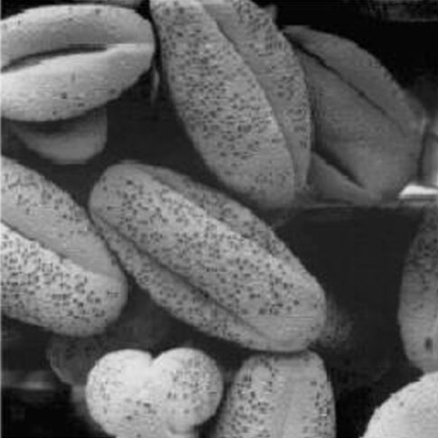
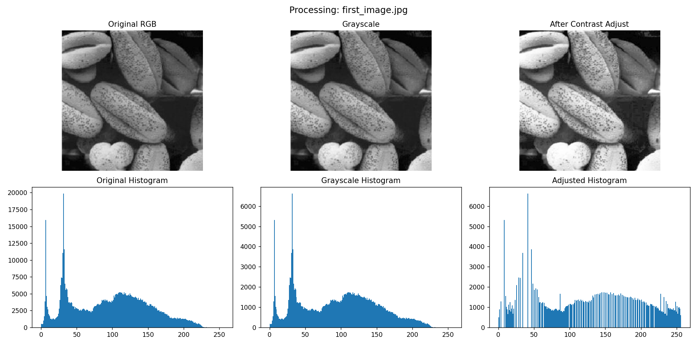
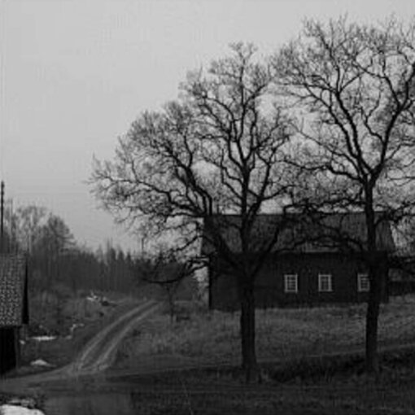
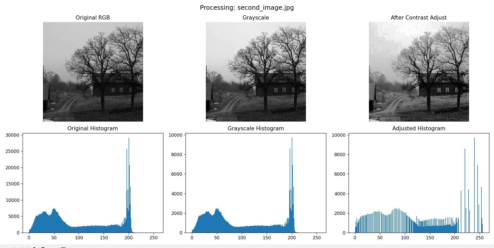

# Image Processing Homework 1 - Contrast Enhancement

## Description
This report demonstrates basic image processing operations using Python, OpenCV, and Matplotlib. We performed grayscale conversion and contrast adjustment on two images.

## Objectives
- Convert RGB image to Grayscale
- Enhance image contrast using histogram equalization
- Compare histograms before and after processing

## Results - Exercise A

**Histogram Comparison:**
- Original Grayscale Histogram
- Enhanced Histogram (after contrast stretching)

## Results - Exercise B (Right Image)

**Histogram Comparison:**
- Original Grayscale Histogram
- Enhanced Histogram (after contrast stretching)

## Conclusion
Contrast enhancement significantly improved the visibility of details in both images. The histograms show better distribution of intensity values after processing, resulting in images with better dynamic range and clarity.
